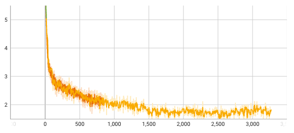
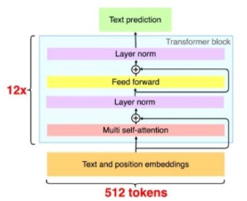
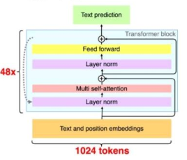
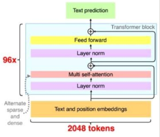

# nano-transformers
Nano-Transformers, another project for Transformer related education and knowledge quick reference purpose.

This project targets at
- help you easily understand Transformers from detailed simple codes
- help you easily write Keras codes, with less complains on TensorFlow (yes, they can be better)

## Data

All required data are already in the "data" folder. You don't need to do pre-processing or downloading. The data is copied from [greentfrapp/attention-primer](https://github.com/greentfrapp/attention-primer) task-5. It's a toy dataset for translation between German and English.

## 2017 Transformer

[2017 Transformer: Attention Is All You Need](https://arxiv.org/pdf/1706.03762.pdf)


- Major innovations:
    - Positional encoding
    - Multi-Head Attention
    - Sequence Mask
    - seq2seq or encode&decode via Parallel Processing, via positional-encoding and sequence-mask
- Existing innovations used:
    - Layer Normalization
    - ResNet

**Nano Transformer**
This project contains nano implementation of Transformer via Keras. You can get a translation model based on around 200K pairs of sentences.

```
python transformer.py --plot
python transformer.py --smoke --tb_dir "logs"
python transformer.py --train --tb_dir "logs"
python transformer.py --predict --input "es ist gut"

tensorboard --logdir logs
```

It takes around 1 hour in Apple Mac Mini M1 to run 1 epoch. If use PyTorch with MPS, it would be around 20 minutes. If use CUDA with good GPU, it would be around 10 minutes.

Here is the loss logs.


## 2018 GPT-1

[2018 GPT-1: Improving Language Understanding by Generative Pre-Training](https://cdn.openai.com/research-covers/language-unsupervised/language_understanding_paper.pdf)



- Major innovations
    - No Encoder
    - Concat the Encoder input with Decoder input
- Existing innovations used
    - Transfomer
    - Fine-turing multi tasks

**Nano GPT-1**
TODO: write the demo codes

## 2019 GPT-2

[2019 GPT-2: Language Models are Unsupervised Multitask Learners](https://cdn.openai.com/better-language-models/language_models_are_unsupervised_multitask_learners.pdf)



- Major innovations
    - Move LayerNorm to earlier place
    - Bigger
- Existing innovations used
    - Transformer
    - Unsupervised, multi-task, zero-shot

**Nano GPT-2**
TODO: write the demo codes

## 2020 GPT-3
[2020 GPT-3: Language Models are Few-Shot Learners](https://arxiv.org/pdf/2005.14165.pdf)



- Major innovations
    - Few-shot prompting
    - Bigger
- Existing innovations used
    - Transformer

**Nano GPT-3**
TODO: write the demo codes

## 2022 chatGPT

TODO: write the demo codes

## Chain of Thought

**Nano CoT**
TODO: write the demo codes

## References

- [greentfrapp/attention-primer](https://github.com/greentfrapp/attention-primer)
    - It's a TensorFlow 1 implementation. That project inspired **nano-transformers**.
- [sainathadapa/attention-primer-pytorch](https://github.com/sainathadapa/attention-primer-pytorch)
    - It's a PyTorch implementation, forked from previous one.
- [karpathy/nanoGPT](https://github.com/karpathy/nanoGPT)
    - It's a PyTorch implementation of GPT2, a rewrite of [karpathy/minGPT](https://github.com/karpathy/minGPT).
    - [Andrej Karpathy](https://karpathy.ai/) was Tesla AI director in 2017-2022. The man behinds the magic. He is actively developing nanoGPT, we can learn a lot from his detailed optimizations.
- The 3 GPT images are captured from [GPT1,2,3](https://www.linkedin.com/posts/ingliguori_gpt1-gpt2-gpt3-activity-7028774382193774592-xdoj).