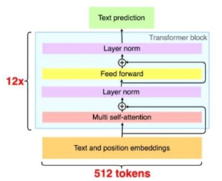

# Nano GPT-1

## Paper

[2018 GPT-1: Improving Language Understanding by Generative Pre-Training](https://cdn.openai.com/research-covers/language-unsupervised/language_understanding_paper.pdf)



- Major innovations
    - No Encoder, just Decoder
- Existing innovations used
    - Transfomer
    - Self Regression pretraining
    - Fine-turing with multiple tasks
    - Byte Pair Encoding
    - GELU

## Codes

A simple GPT-1 with 2 layers decoder block.
In this gpt-1.py, no BPE, no GELU, just for simplicity.

```bash
python gpt-1.py --plot
python gpt-1.py --smoke
python gpt-1.py --train
python gpt-1.py --predict --input "I want to" 
```

## Sample outputs

Trained 1 epoch on simplebooks-92.

- Input: I want to

Output: I want to see you , " and he <unk> his <unk> . " I have a <unk> , and I have n't any <unk> to <unk> him . "

- Input: Who is

Output: Who is this ? " asked Tom , " I have n't any idea that I have n't any <unk> . "
