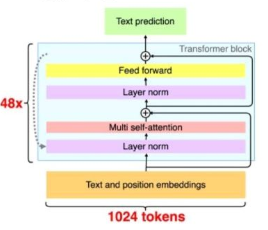

# Nano GPT-2

## Paper

[2019 GPT-2: Language Models are Unsupervised Multitask Learners](https://cdn.openai.com/better-language-models/language_models_are_unsupervised_multitask_learners.pdf)

- Major innovations
    - Move LayerNorm to earlier place, add one final LayerNorm after final self-attention
    - Initilize scale according to number of residual layers
    - Input tokenizer: byte-level Byte-Pair-Encoding, not word level
    - Bigger
- Existing innovations used
    - Transformer
    - Unsupervised, multi-task, zero-shot

## Codes

TODO: write the demo codes

## Reference

- https://huggingface.co/docs/transformers/model_doc/openai-gpt#transformers.TFOpenAIGPTDoubleHeadsModel.call.example
- https://huggingface.co/docs/transformers/model_doc/gpt2#transformers.GPT2Tokenizer.example
