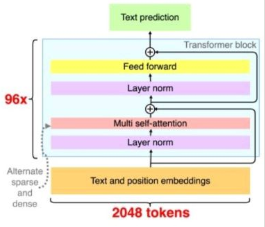

# Nano GPT-3

## Paper

[2020 GPT-3: Language Models are Few-Shot Learners](https://arxiv.org/pdf/2005.14165.pdf)



- Major innovations
    - Alternating dense and locally banded sparse attention patterns in the layers of the transformer, similar to the Sparse Transformer
    - Few-shot prompting
    - Bigger
- Existing innovations used
    - Transformer

## Codes

- Use Apple ASF-simple (Attention Free Transformer).

```
python gpt-3.py --sample
python gpt-3.py --plot
python gpt-3.py --smoke --predict
python gpt-3.py --train --predict
python gpt-3.py --predict --input "I don't want to"
```


## Samples

- Input: I want to
Output: I want to see you , " said the <unk> , " and I 'll tell you what I can do . "

- Input: I don't want to
Output: I don't want to see you , and I 'll tell you what I can do . "
