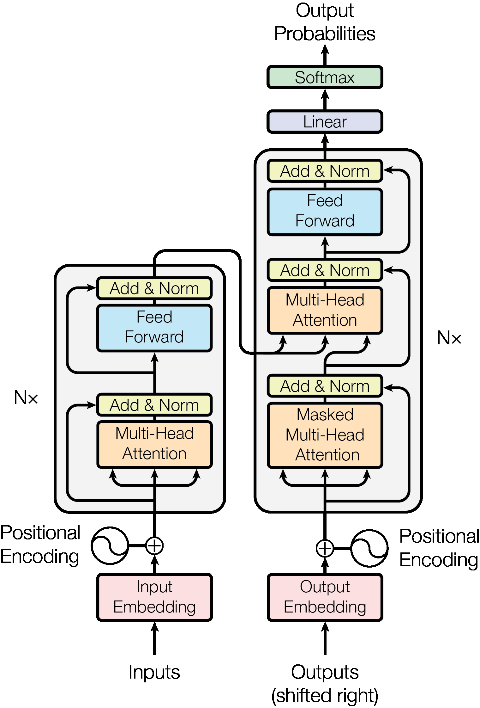
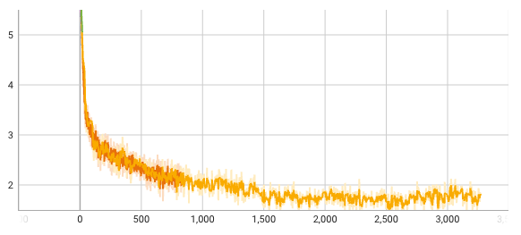

# Nano Transformer

This project contains nano implementation of Transformer via Keras. You can get a translation model based on around 200K pairs of sentences.

For easy understanding, each file is self-contained, no dependency on other files.

## Paper
[2017 Transformer: Attention Is All You Need](https://arxiv.org/pdf/1706.03762.pdf)



- Major innovations:
    - Positional encoding
    - Multi-Head Attention
    - Sequence Mask
- Existing innovations used:
    - Layer Normalization
    - ResNet

## Codes

### Versions:
- transformer.py
  A simple version which uses sparse category without one-hot, it's faster.
- transformer_onehot.py
  A basic version which uses onehot, it's slow but more easy to be understood.

```
python transformer.py --plot
python transformer.py --smoke
python transformer.py --train
python transformer.py --predict --input "sie sind großartig"
```

### Logs
Here is the loss logs of each steps.


The training logs. It takes 2.3 minutes to train the 40Mb copus in Mac M1.
